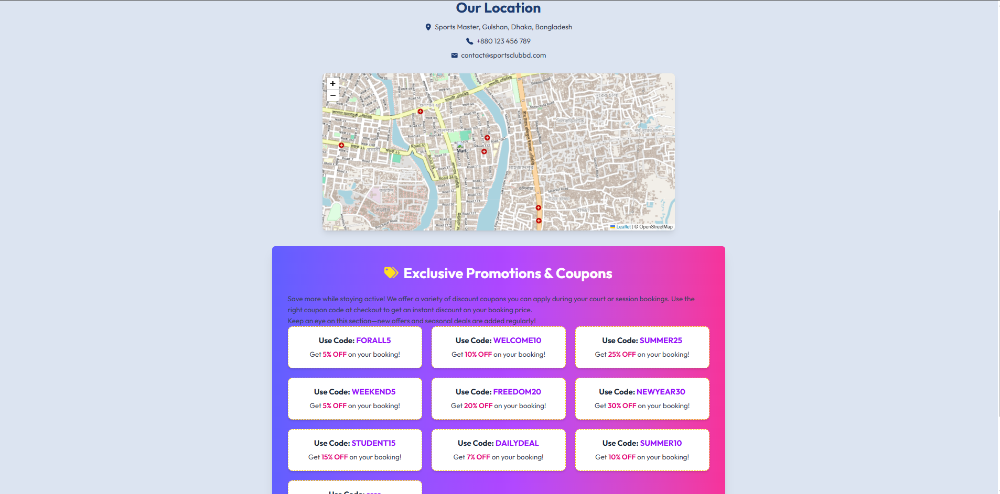

## Project Overview
This is a plant management web application that allows users to log, track, and manage care tasks for their houseplants. Users can add their plants, log watering/fertilizing dates, set reminders, and track plant health. The platform will support user authentication and personal plant data management.

Live Demo

[Live Site Link](https://sports-master-sm.web.app)

---

## 🛠️ Technologies Used

### Client-side:
- React
- Tailwind CSS
- DaisyUI
- React Router DOM
- TanStack Query (React Query)
- Axios + AxiosSecure
- Firebase Authentication
- Stripe Payment Integration
- JWT for secure route access

### Server-side:
- Node.js
- Express.js
- MongoDB + Mongoose
- JWT Authentication & Middleware
- Stripe API
- dotenv
- CORS

---

## ✨ Core Features

- 🔐 **Authentication & Authorization:**
  - Firebase login (email/password, Google)
  - JWT-secured APIs
  - Role-based dashboards: Admin, Member, and User

- 📅 **Booking System:**
  - Book training sessions
  - Admin approval/rejection system for bookings
  - Display pending/approved bookings by role

- 💳 **Payment Integration:**
  - Stripe payment gateway
  - Apply coupons for discounted prices
  - Track payment history

- 📋 **Challenges & Activities:**
  - Join and view club challenges
  - Toggle between card and table view

- 📊 **Admin Dashboard:**
  - Manage users (promote to member/admin)
  - Approve/reject bookings
  - View all system stats and data

- 📱 **Responsive Design:**
  - Fully responsive on mobile, tablet, and desktop

---

## 📦 Dependencies

### Client:
- react
- react-dom
- react-router-dom
- tailwindcss
- daisyui
- @tanstack/react-query
- axios
- firebase
- jwt-decode
- react-hook-form
- stripe-js

### Server:
- express
- mongodb
- mongoose
- cors
- jsonwebtoken
- dotenv
- stripe

📚 Additional Resources
[Firebase Documentation](https://firebase.google.com/docs)

[MongoDB Documentation](https://www.mongodb.com/docs/)

[React Router](https://reactrouter.com)

[Stripe Documentation](https://docs.stripe.com)

📬 Contact
For questions or feedback, reach out:
[LinkedIn](https://www.linkedin.com/in/syed-sifat2004/) 

